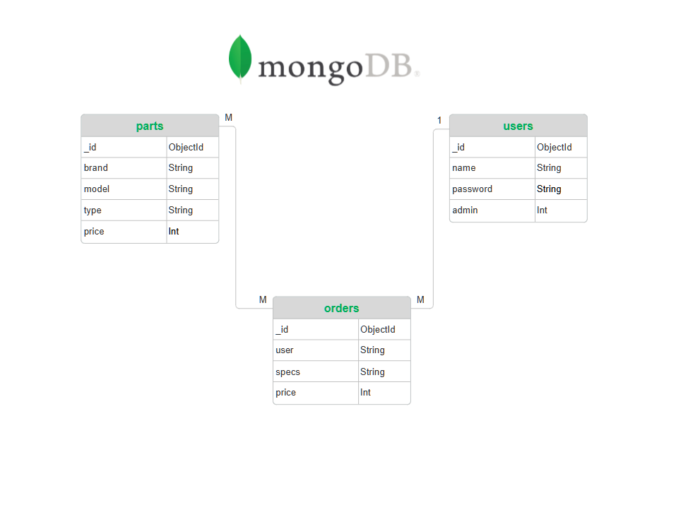

# The Computer Store

This is a Python CLI-based store you can purchase computer parts from. There are a variety of parts in the inventory and you can filter them by type for a simpler shopping experience. Additionally, the store supports multiple users and tracks order history for each. An admin dashboard is also available for modifying store and user data.

## Setup

Download the project and run ```main.py``` to start the program.
> [!IMPORTANT]
> Ensure all relevant dependencies are installed beforehand.

## Options
- ```add``` to add a part to the cart.
- ```delete``` to remove a part from the cart.
- ```cart``` to view the current cart.
- ```checkout``` to finalize and checkout an order.
- ```orders``` to view order history.
- ```admin``` to access the admin dashboard.
- ```exit``` to cancel and exit the store.

## Tech Stack
- Python 3
	- colorama
    - pymongo
- MongoDB
- git (+ GitHub)

## Entity Relationship Diagram


## Credits

The entity relationship diagram was created using [SmartDraw.](https://www.smartdraw.com/entity-relationship-diagram/)

Icons used in the presentation slides were obtained from [Flaticon.](https://www.flaticon.com/free-icons/)